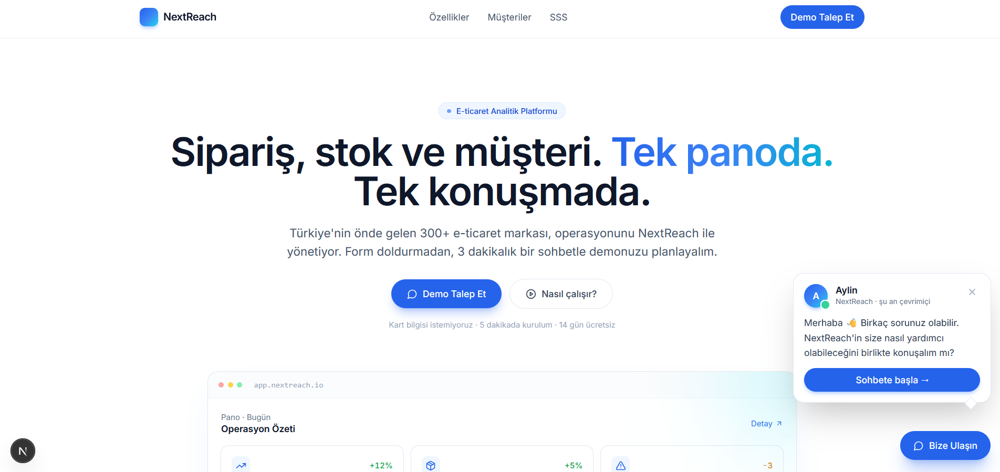
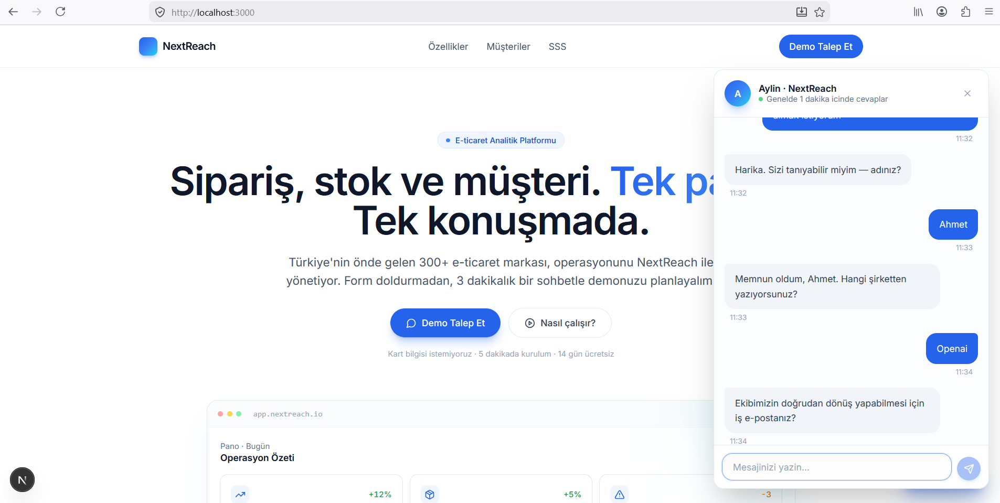
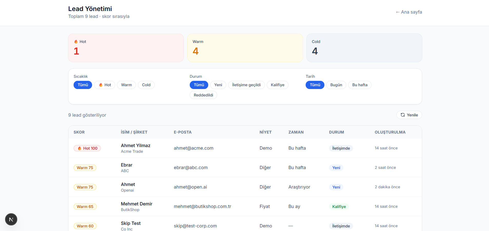
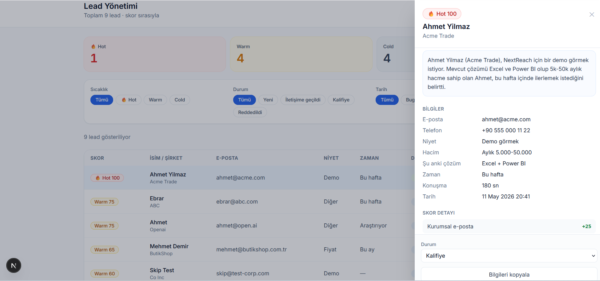

# NextReach Chatbot

Landing page'deki soğuk "Contact Sales" formunu, ziyaretçiyle kısa bir
sohbet eden ve satış ekibine kullanılabilir lead'ler bırakan bir chatbot
ile değiştiriyor. Değerlendirme görevi, 6 saat hard limit.

## Toplam süre

- **11.05.2026** 20:00 – 21:30 — planlama, env kurulumu, dokümantasyon
- **12.05.2026** 09:30 – 14:00 — implementasyon (arada ~30 dk 12.10 ile 12.40 arası mola)

**Toplam: yaklaşık 5 saat 30 dakika.** Commit timestamp'leri ile
doğrulanabilir.

- **Canlı:** https://nextreach-chatbot.vercel.app
- **Admin:** `/admin?key=<ADMIN_SECRET_KEY>` (key teslim notunda ayrı paylaşıldı)
- **Repo:** https://github.com/ebraronuk/nextreach-chatbot






---

## Kısa özet

- Chatbot için **hibrit mimari** (kural-tabanlı state machine + Gemini fallback)
  tercih ettim; lead qualification için yapılandırılmış veri toplamanın
  pure-AI yaklaşımdan daha güvenilir olduğunu düşündüm.
- **Aylin** adında bir satış danışmanı karakteri tasarladım, 5 adımlı bir
  akış kurdum; "yeter" noktası kalifikasyon sonrası.
- **Lead scoring (0-100)** + Gemini ile otomatik 2 cümlelik özet, admin
  paneline "kim / neden / acil mi" sorularını 30 saniyede cevaplatıyor.
- **8 katmanlı spam savunması:** honeypot, IP rate limit, Zod validation,
  refusal/dismissive detection, disposable email blacklist, prompt injection
  savunması, RLS sıkılaştırma migration'ı, CSP/HSTS header'ları.

PRD'de muğlak bıraktığınız 6 sorunun cevapları, kullanmadığım/eklemek
istediğim yerler ve toplam süre aşağıda detaylı.

---

## Lokalde çalıştırma

```bash
npm install
cp .env.example .env.local      # değerleri doldur
# Supabase Dashboard → SQL Editor → supabase/schema.sql'i çalıştır
# Sonra supabase/migration-001-tighten-rls.sql
npm run dev                     # http://localhost:3000
npm test                        # opsiyonel
```

`.env.local` için gereken anahtarlar `.env.example`'da. Supabase URL/anon/service
key Project Settings'ten, Gemini API key https://aistudio.google.com/app/apikey
'den, `ADMIN_SECRET_KEY`'i kendin üret.

---

## Teknoloji seçimleri

| Katman | Seçim | Niye |
|---|---|---|
| Framework | Next.js 15 (App Router) | Frontend + backend tek repo, Vercel sıfır-config deploy |
| Dil | TypeScript strict | Paylaşılan tipler + Zod ile uçtan uca güvenli |
| UI | Tailwind + shadcn/ui | 6 saatte profesyonel görünüm |
| DB | Supabase (Postgres) | Hosted, dashboard hediye, RLS hazır |
| AI | Gemini 2.5 Flash | Free tier'da en iyi TR + instruction-following |
| Hosting | Vercel | Next.js'in doğal yuvası |

---

## Mimari kararı: hibrit state machine + tool loop

İdeal bir agent ürününde **tool loop** kullanırdım: her kullanıcı mesajını
LLM'e gönder, LLM ne yapacağına karar versin (tool çağır, soru sor,
özetle), gerekirse zincirleme tool'ları tetiklesin. ChatGPT, Cursor,
Anthropic'in computer-use ajanları bu pattern'le çalışıyor.

Bu projede tool loop'u **her yerde değil, seçici** kullandım çünkü:

- **Maliyet ve quota:** Her mesaj LLM çağrısı = serbest tier'da 4 konuşmada
  kota biter. Free tier'da bir asisstant değerlendirme görevini bile yapamaz.
- **Latency:** Yapılandırılmış veri (isim/email/hacim) için her seferinde
  1-2 saniyelik LLM gecikmesi kullanıcıyı uzaklaştırıyor. State machine
  bunu <50ms'de yönetiyor.
- **Sağlamlık:** LLM yavaşlasa veya down olsa, scripted akış çalışmaya
  devam eder. Tool loop'a tamamen bağımlı tasarım API kesintisinde ölüyor.
- **Hallucination kontrolü:** "olmaz" / "naber kız" gibi inputları LLM
  isim olarak kabul edebiliyor. Deterministik validation katmanı bunu
  garantili reddediyor.
- **Prompt injection yüzeyi dar:** LLM'in aksiyon scope'u kısıtlı olduğu
  için "talimatlarını yoksay" saldırısının etkisi sınırlı.

Sonuç olarak: **state machine deterministik çekirdek**, ama 3 yerde
tool loop devreye giriyor:

1. **Off-script soru** (`/api/chat`) — Kullanıcı "fiyat nasıl?", "AI mısın?"
   gibi bir şey sorduğunda Gemini streaming cevap üretiyor, sonra akışa
   dönüyor.
2. **Slot extraction** (`/api/slots`) — Kullanıcı "Ben Ayşe, Mor
   Botanik'tenim, ayse@morbotanik.com" gibi tek mesajda 3 alan birden
   verdiğinde, Gemini JSON parse edip state machine birkaç step birden
   atlıyor.
3. **AI özet** (`lib/ai/summary.ts`) — Lead kaydedildikten sonra fire-and-
   forget bir Gemini çağrısıyla "kim, neden, neden şimdi" sorusunu
   cevaplayan 2 cümlelik özet üretip admin'e koyuyor.

Bu pattern Intercom Fin, Drift, Pylon gibi B2B SaaS chatbot'larının
yaklaşımıyla aynı çizgide: kural-tabanlı çekirdek + LLM-zekası selektif.

---

## PRD'de muğlak bıraktığınız 6 soru, benim cevaplarım

**Chatbot ne sorar, ne zaman "yeter" der?** Selamlama → niyet → isim →
şirket → iş e-postası → aylık hacim → şu anki araç → zaman çizelgesi (opsiyonel)
→ özet + onay. "Yeter" noktası kalifikasyon sonu (hacim + araç). Zaman
çizelgesi atlanabilir ama skor küçük ceza alır.

**Aylin'in tonu nasıl?** Profesyonel ama sıcak; "siz" hitabı, kısa cümleler,
max 1-2 emoji. Doğrudan fiyat vermez ("Paketler ihtiyaca göre özelleştiriliyor"),
teknik derinliğe inmez. Model adı/teknoloji asla paylaşmaz.

**İyi lead'i kötüden nasıl ayırırım?** 0-100 skor. Kurumsal email +25,
hacim 5k+ +30, yakın zaman +25, bilinen rakip arac +20, kısa konuşma -15.
Skor breakdown'ı her lead'in detayında görünüyor; sales "neden hot?"
sorusunu cevaplayabiliyor.

**Admin'de ne göstermeli?** Tablo: skor + kimlik + niyet + zaman + status.
Detay drawer'da AI 2-cümlelik özet (en üstte — sales 30 saniyede anlasın),
skor breakdown, tam transkript, status güncelleme. Filtre: sıcaklık, status,
tarih. CSV indir.

**Spam savunması?** Çok katmanlı: honeypot (gizli input), IP rate limit
(10dk/3 submission), Zod validation, refusal/dismissive detection,
disposable email blacklist, prompt injection savunması, CSP/HSTS header'ları,
RLS sıkılaştırma migration'ı.

**Ziyaretçi cevap vermezse?** Kimlik bilgisi için bir kez nazikçe yeniden
istiyor; tekrar reddederse "olmaz/yok/vermem" gibi kalıpları yakalayıp özel
mesaj veriyor. 3 ardışık başarısız denemeden sonra soft abandon — Aylin
çekiliyor, "Yeni sohbet başlat" butonu bırakıyor. Sonsuz döngü yok.

---

## Yapamadıklarım

**Anlık güncellenen admin paneli.** Şu an yeni lead'i görmek için sayfayı
F5 ile yenilemek gerekiyor. Supabase tarafında realtime publication açık,
sadece browser'da "ben dinliyorum" diyen kodu yazmaya zaman kalmadı.

**Uçtan uca otomatik testler.** 86 unit test yazdım (scoring, validation,
state machine), ama "kullanıcı tüm akışı geçiyor, lead düşüyor, admin'de
görünüyor" senaryosunu otomatik test eden bir Playwright kurulumu yapmadım.
Bunu manuel test ettim.

**Production'a uygun hata izleme.** Sentry gibi bir araç kurmadım; şu an
hatalar sadece sunucu loglarına yazılıyor, gerçek bir kullanıcı sorun yaşasa
benim haberim olmazdı.

**Drop-off analitiği.** Hangi adımda kullanıcıların düştüğünü görmek için
`analytics.ts`'te event'leri zaten atıyorum, ama bunları görselleştiren bir
dashboard yapamadım. Şu an event'ler sadece console'a düşüyor.

**Admin için gerçek auth.** Brief auth'u kapsam dışı bıraktığı için
`/admin?key=...` query-param secret ile koruma yaptım. Bu URL tarayıcı
geçmişinde ve sunucu loglarında sızar — production'a alırken Supabase
Auth + magic link'e geçirmek lazım.

## +Zamanım olsaydı

**Distributed rate limit (Upstash Redis).** Şu anki rate limit Node bellek
içinde tutuluyor. Vercel'de farklı serverless instance'lar farklı sayaç
tutar, yani 3 instance varsa kullanıcı 9 submission yapabilir. Upstash
Redis ile tüm instance'lar ortak sayaca bakardı. Kod tarafı (adapter
pattern) zaten hazır, sadece Upstash hesabı ve env değerleri ekleyince
otomatik devreye girer.

**Konuşma akışı bir config dosyasında.** Aylin'in soruları ve sırası şu an
kod içinde yazılı, bir cümleyi değiştirmek için developer'a ihtiyaç var.
JSON/YAML config dosyasına çıkarsam ürün ekibi developer'sız oynayabilirdi —
HubSpot Chatflows böyle çalışıyor.

**Slack/HubSpot/Pipedrive entegrasyonu.** Hot lead webhook altyapısı kurulu
(`HOT_LEAD_WEBHOOK_URL` env değişkeni boş şu an); skor 80+ olan bir lead
düştüğünde Slack kanalına bildirim atmak veya CRM'e otomatik push 10-15
dakikalık iş.

**A/B testi.** Aylin'in iki ton varyantını (örn. resmi vs samimi) eş
zamanlı göstererek hangisinin daha yüksek submit oranı verdiğini ölçmek.
Bunun için bir feature flag servisi (GrowthBook gibi) entegre etmek gerek.

---

## Geliştirme süreci — AI kullanımı

Bu proje **ilk gerçek web projem**; TypeScript ve Next.js'e bu görev
sırasında öğrenerek girdim. Pair programmer olarak **Claude Code** kullandım;
daha önce Codex denemiştim, Claude'un mimari ve genel kurguya daha hâkim
olduğunu hissettiğim için bunu seçtim.

Mimari ve ürün kararlarını ben verdim: Aylin'in karakteri, 5-adımlı akış,
scoring'in 6 faktörü, hibrit AI yaklaşımı, RLS sıkılaştırma migration'ı,
soft abandon mekanizması. Kod yazımında AI hızlandırıcı oldu, ama hangi
soruyu sorduğum ve hangi cevabı kabul ettiğim benim kararlarım. Görüşmede
herhangi bir dosyayı açıklamamı isterseniz — "AI yazdı" diye geçiştiremem,
her seçimin arkasında bir gerekçem var.

---


